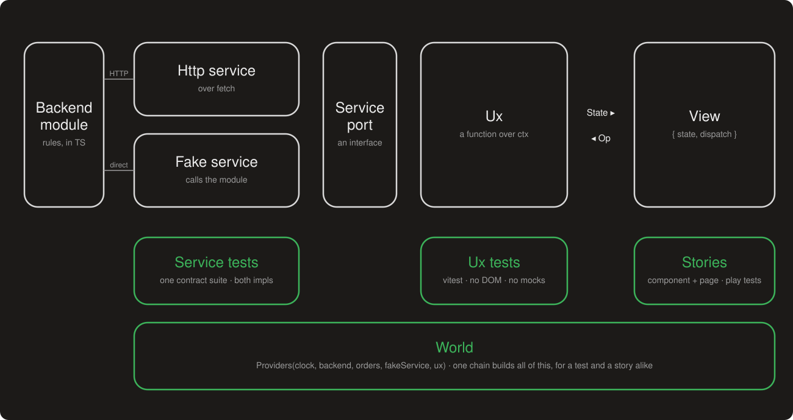

# Humble UI Stack: an applied frontend architecture

Dispatch is a small shipping dashboard: orders you can cancel or refund, shipments you can hand to
a carrier and mark delivered. It exists to demonstrate the humble UI stack, an architecture for frontend
applications drawn from years of building them and from watching agents build them. The humble view is the idea
[the post](https://lab.photomancer.art/post/2026-09-humble-ui-stack/) is built around; this repo is
the whole arrangement, and the UI is the humble part. The humble view's name is not mine: it is the
heading Martin Fowler gave the idea in 2006, crediting Michael Feathers's Humble Dialog Box and
Gerard Meszaros's Humble Object.

- **Live dashboard:** https://photomancerart.github.io/humble-ui-stack/
- **Storybook:** https://photomancerart.github.io/humble-ui-stack/storybook/
- **The posts:** [The Humble UI Stack](https://lab.photomancer.art/post/2026-09-humble-ui-stack/), which
  builds on [Providers](https://lab.photomancer.art/post/2026-08-04-providers/) and
  [Fixture builders](https://lab.photomancer.art/post/2026-08-04-fixture-builders/).
- **For agents:** start at [AGENTS.md](./AGENTS.md). The formal decision record is
  [ADR 0001](./docs/adr/0001-service-ux-view-layers.md).

## The goal

> Every rule in the app is reachable by a plain function call, in an environment you can build in
> one expression, and that environment is proven equivalent to production.

That sentence is the architecture. Everything below is what it takes to make it true:

- The **humble view** keeps rules out of JSX, and **actions as data** leave the view nothing to
  decide.
- Every **service** ships a fake and a real implementation with one contract suite, so the
  environment is trusted rather than assumed. The **backend is a module**, so the fake is the
  backend without the network.
- **Providers** make the environment one expression, and **builders** make its data one
  expression.
- **Stories** render that same environment, so the view gets its own proof with no backend.
- **Component layers** and **feature modules** keep the environment small enough to hold in one
  head, or one context window.

Agents are part of the motivation. An agent working here runs a feature's whole test loop with no
browser, holds one feature in context, and has its conventions checked by a script rather than a
reviewer.



The same Ux and the same backend module run in all three columns. Only the service adapter and the
process boundary change, and one contract suite proves the two adapters equivalent. There is a
fourth column not drawn: the full-app story, which runs the Http adapter over the backend routes
answering in-process. That is also what GitHub Pages serves.

## The whole idea in one test

This drives the orders feature — services, rules, state — with nothing rendered and nothing mocked:

```ts
test(
  "cancelling a pending order",
  Providers(
    provideFakeClock,
    provideFakeBackend(),
    provideAdmin,
    provideOrders([{ customer: "Radia", status: "pending" }]),
    provideFakeOrderService,
    provideOrdersUx,
  ),
  async ({ ordersUx, orders }) => {
    await ordersUx.dispatch({ kind: "load" });
    const [row] = ordersUx.getState().rows;
    expect(row?.actions.find((a) => a.op.kind === "cancel")?.affordance.status).toBe("available");

    await ordersUx.dispatch({ kind: "cancel", orderId: orders[0]!.id });

    expect(ordersUx.getState().rows[0]?.status).toBe("cancelled");
  },
);
```

The [page story](./packages/feat-orders/src/view/OrdersPage.stories.tsx) boots the real screen on
the same six-link chain and drives the same flow with a play test.

## Decisions

Nine decisions, each in the same shape: the problem, what this repo does, what it does that
instead of, where the idea comes from, and what it costs. The first four are about where logic
lives, the next two about how things are wired, the last three about how the UI is organized.

### 1. The humble view

**Problem.** UIs are hard to test. Browser tests are slow, flaky, expensive to set up, and worse in
CI, and the pain stays proportional to how much logic sits behind the DOM. The usual response is
better browser tooling, which helps without changing the ratio.

**Decision.** Make the view small instead of making it testable. The **View** is a React component
of `{ state, dispatch }`: it renders, dispatches, and decides nothing. Everything that decides —
which actions apply, to whom, what happens while one is in flight, how a refusal comes back — lives
in the **Ux**, a factory function over an explicit context with no framework in it. Ux tests are
plain vitest with no DOM. See [`OrdersUx.ts`](./packages/feat-orders/src/ux/OrdersUx.ts) and
[`OrdersView.tsx`](./packages/feat-orders/src/view/OrdersView.tsx).

**Instead of.** Logic in hooks, tested through React Testing Library. That is the mainstream, and
it means every test pays for the DOM and every rule is reachable only by rendering.

**Elsewhere.** Feathers's Humble Dialog Box, generalized by Meszaros as the Humble Object and
named Humble View by Fowler alongside Passive View; the Elm
architecture, where an Op is the message and State is the model; MVVM, where the Ux is the
ViewModel and emits a snapshot instead of observable properties.

**Cost.** The discipline of never putting a domain `if` in JSX, and a State that must be projected
on every change. Browser tests do not go to zero. They go to few, and none of them carries a rule.

### 2. Actions as data

**Problem.** "May the user do this?" ends up answered three times per button: whether to show it,
whether to enable it, and again in the handler. The three drift, and none of them can say why.

**Decision.** The Ux emits **actions**: an op, a label, and an **affordance**. The affordance is
semantic — `available`, `disabled(reason)`, `forbidden(reason)`, `unavailable` — and the surface
decides presentation. [`ActionButton`](./packages/ui-app/src/action/ActionButton.tsx) is the one
place that decides how each looks: grey with the reason on hover, a lock for forbidden, nothing for
unavailable. Progress is data: an in-flight op is `disabled` with `progress`. Confirmation is
presentation: the action carries `confirm`, the surface asks, the Ux never models a pending
confirmation. Dispatch re-validates, so a stale View cannot make the Ux do what the State said it
could not.

**Instead of.** A `disabled` boolean computed in the component, and a permissions hook.

**Elsewhere.** WPF's `ICommand.CanExecute`, with a reason attached. Hypermedia controls, where the
server tells the client what it may do next.

**Cost.** A vocabulary to learn, and the rule that no action field exists without a renderer and a
story that honors it.

### 3. Services with verified fakes

**Problem.** Fakes drift. Network mocks agree with the code the day they were written; a mock per
test and a handler per story means the same lie told many times.

**Decision.** Every feature reaches the outside through a **Service** interface with two
implementations, `Http*` over a fetch-shaped client and `Fake*` over the simulated backend, and
one contract suite run against both. The fake also takes a
[`FakeScript`](./packages/app-core/src/testing/FakeScript.ts): latency, fail-on-cue, and a
`settle()` that waits for calls in flight, so a test can script the story's hard states. See
[`OrderService.contract.ts`](./packages/feat-orders/src/service/OrderService.contract.ts).

**Instead of.** `msw` handlers per story and `vi.mock` per test. Neither is in this repo.

**Elsewhere.** Hexagonal architecture, or ports and adapters; contract tests; verified fakes in
Google's testing writing.

**Cost.** An interface and a second implementation per service. It is the one decision that pays
twice: testing first, and then a free change of transport, since a mobile app or a second protocol
is a new adapter the Ux never notices.

### 4. The backend is a module

**Problem.** A frontend demo without a backend is fake data. With one, it needs a server, a port,
and a service in CI. And the rules that cross features need one home.

**Decision.** [`packages/backend`](./packages/backend) is the backend, simulated: domain, in-memory
store, rules, and Hono routes, in TypeScript. The rules — cancel only while pending, refund only as
admin, a delivered shipment delivers its order — live there once. Fakes call it directly. `Http*`
services call the routes through a fetch-shaped function: the network, or `routes.request`
in-process. The deployed dashboard mounts the routes in the browser, so GitHub Pages runs the real
HTTP path with no server.

**Instead of.** A parallel model of the server in the browser, or feature-owned store slices with
hooks between them, which would leave the cross-feature rule in the composition root where no
feature test could see it.

**Elsewhere.** Mirage JS and `msw` as in-browser servers. The difference here is that it is the real
code, not a model of it.

**Cost.** A package a real product replaces. Authorization is stated twice, in the Ux so the UI can
explain and in the backend so it is enforced; the Ux turns a refusal into a notice and a refetch.

### 5. Providers and worlds

**Problem.** Dependency injection in TypeScript is class-based and decorator-based, and the two
decorator specs disagree. Test setup is `beforeEach` with a row of `let`s, each an independent
variable to keep in your head.

**Decision.** A **provider** is `(ctx) => moreCtx`. `Providers(a, b, c)` folds a typed chain, checked
at compile time; links may be async; disposal runs in reverse through `Symbol.asyncDispose`.
`test(name, world, fn)` builds the chain, hands its context to the body, and disposes it after. A
**world** is a chain used as a test's or story's environment, and the chain a Ux test runs in is
the chain its page story boots. See [`Providers.ts`](./packages/ux-core/src/provider/Providers.ts)
and [`provideDispatchApp.ts`](./apps/dashboard/src/provideDispatchApp.ts), the one place the whole
app is wired.

**Instead of.** InversifyJS, tsyringe, or Nest-style containers; `beforeEach`; a state library with
its own testing story.

**Elsewhere.** pytest fixtures; Effect's `Layer`; Go's functional options. The full version is
[ts-provide](https://github.com/PhotomancerArt/ts-provide); this repo vendors it without ambient
context, because in the browser a Ux takes its context explicitly.

**Cost.** About a hundred and thirty vendored lines, the habit of passing `ctx`, and a typed chain
of at most eight links. `provideDispatchApp` uses all eight.

### 6. Builders

**Problem.** Fixtures in data files go stale. Fixtures in code are massive and repetitive. Either
way a test's precondition is far from its assertion.

**Decision.** `TestOrder(backend).create(overrides)` creates a row through the backend's own create
path and returns a live handle, `{ id, get }`. Defaults are sensible, so a test writes only the
field it cares about. `provideOrders([...])` composes the builder as a provider, so the rows land
in the test's context by name. See [`TestOrder.ts`](./packages/backend/src/testing/TestOrder.ts)
and [`worlds.ts`](./packages/backend/src/testing/worlds.ts).

**Instead of.** JSON fixtures, hand-built objects, or writing to the store directly.

**Elsewhere.** Test Data Builder and Object Mother; `factory_bot` in Rails; `fishery` in TypeScript.
Composing a builder as a provider is the local part.

**Cost.** A builder per aggregate, and rows created sequentially so ids are stable.

### 7. Stories as the second proof

**Problem.** Some states are hard to reach — an error banner, a carrier that fails, a role that may
not refund — and design work needs each one in isolation. And the view does need some browser
proof.

**Decision.** **Component stories** render hand-built states from each feature's `sampleStates`.
**Page stories** boot the Ux on the test's world inside
[`World`](./packages/ux-core/src/react/World.tsx) and carry `Test:` play stories. The
[full-app story](./apps/storybook/src/Dispatch.stories.tsx) runs the composition root over the
routes in-process, which makes page-level demos and design work possible with no server. Play
tests run headless in CI.

**Instead of.** A separate end-to-end suite against a deployed environment; stories with network
handlers.

**Elsewhere.** Storybook's Component Story Format and play functions; the Vitest addon that runs
them.

**Cost.** A story file per component, a `sampleStates` file per feature, and Chromium in CI.

### 8. Component layers

**Problem.** Look and feel drifts when every feature reaches for raw primitives, and an app-level
component quietly absorbs a domain rule because nothing stops it.

**Decision.** UI code lives in four layers: [`ui-design`](./packages/ui-design) (tokens, colours,
treatments), [`ui-base`](./packages/ui-base) (shadcn primitives copied in; knows nothing of the
app), [`ui-app`](./packages/ui-app) (tables, layouts, status badges, action buttons — the app's
common language, and the only UI package that knows what an affordance is), and the page layer
inside each feature. They are separate packages, so the boundary is enforced by the build.

| Layer   | Package     | Holds                                                      | Note                                     |
| ------- | ----------- | ---------------------------------------------------------- | ---------------------------------------- |
| Design  | `ui-design` | colours, typography, breakpoints, light and dark           | Tailwind 4 theme and CSS variables       |
| Base    | `ui-base`   | button, dialog, menu, table, badge                         | shadcn/ui, copied in; no app knowledge   |
| App     | `ui-app`    | AppShell, ListLayout, DataTable, StatusBadge, ActionButton | the app's common language; cross-feature |
| Feature | `feat-*`    | OrdersView, OrdersPage, and any local component            | single-feature; where React meets a Ux   |

**Instead of.** One components folder with lint-enforced boundaries. A lint rule is a convention
with a linter; a package boundary is a build failure.

**Elsewhere.** Atomic Design; shadcn's copy-in model; design tokens.

**Cost.** Four packages, and a decision per component about where it belongs. Features may keep a
local component at any layer when they need one; the shared packages are the default home, not a
rule against local UI. There is a real tension here: the app layer is domain-free, so a card two
features both want is a generic `RecordCard` each feature shapes, not a shared `ShipmentCard`. That
is truer to the design, and it is a cost that grows with the number of features.

### 9. Feature modules

**Problem.** CI time and dependency management grow with the app. One package means every change
tests everything, and any file may import any other.

**Decision.** [`feat-orders`](./packages/feat-orders) and
[`feat-shipments`](./packages/feat-shipments) are packages that never import each other or the
apps. A cross-feature reaction is an event on the bus plus a refetch; the rule itself ran in the
backend. `pnpm check:deps` fails CI on a violation, and turbo runs each package's tests alone and in
parallel.

**Instead of.** A folder per feature in one package; lint-enforced module boundaries; module
federation.

**Elsewhere.** Feature-Sliced Design; Nx module boundaries; vertical slice architecture.

**Cost.** Events instead of function calls between features. This is also the one decision here
that is still an experiment: it has not shipped in a product yet, and a two-feature demo shows the
mechanism, not the scaling.

## Taste and style

Choices the architecture would survive without. They are here because they make the code read
consistently, and because an agent follows a stated convention better than an implied one.

### Naming

Naming is the most under-appreciated part of this repo. A name is the first thing a reader sees and
the last thing anyone changes, so a wrong one is a small lie every reader has to undo. The same
thing exists in many layers here — an order is a row in the backend, a `ServiceResult`, a field of
`OrdersState`, a `DataTable` row — so a name must carry its layer, not just its subject. The
vocabulary is fixed, and filenames follow it:

| Term       | Meaning                                                                                                    |
| ---------- | ---------------------------------------------------------------------------------------------------------- |
| Service    | Interface to something outside the Ux. `Http*` + `Fake*` + one contract suite run against both.            |
| Provider   | `(ctx) => moreCtx`, composed with `Providers(...)`. The only way anything gets a service.                  |
| World      | A provider chain used as a test's or story's environment.                                                  |
| Builder    | `TestOrder(backend).create(overrides)`: creates rows through the backend, returns a live handle.           |
| Op         | Typed command the Ux accepts. Plain data.                                                                  |
| Affordance | Semantic availability of an op: `available` / `disabled(reason)` / `forbidden(reason)` / `unavailable`.    |
| Action     | An op + its affordance + label (+ `confirm`, `destructive`, `progress`). Carried by State.                 |
| State      | The read model the Ux emits: serializable, complete, no functions.                                         |
| Ux         | Controller factory over ctx: `getState`, `subscribe`, `dispatch(op)`, `dispose`. Re-validates on dispatch. |
| View       | React component of `{ state, dispatch }`. Renders, dispatches, decides nothing.                            |
| Page       | Where React meets a Ux: `useUx(ux)` feeding a View.                                                        |
| Event      | Cross-feature message on the bus. Features never import each other.                                        |

`OrdersUx.ts`, `OrdersView.tsx`, `OrdersPage.stories.tsx`, `OrderService.contract.ts` tell you what
they are before you open them, and [AGENTS.md](./AGENTS.md) turns the table into a checklist: the
name says which package the file goes in and what shape its export has. Factories are named like
their types, so `OrdersUx(ctx)` returns an `OrdersUx` and `TestOrder(backend)` is the builder for
orders. The primary export is the first declaration after the imports, and the filename matches it.

### Everything else

- **No classes.** Constructors cannot be async, so a class with async setup needs an `init` method
  and a nullable field for everything until it runs. A factory function can await and return a
  finished object, closures give privacy for free, and structural typing makes an interface plus a
  factory the same shape as a class. There is not one `class` in this repo.
- **Context is explicit.** No ambient context in the browser; a Ux takes `ctx` as an argument. That
  is also why the tests read the way they do.
- **Expected failures are results, not throws.** A service returns `ServiceResult<T>` for a refusal
  the Ux can explain; it throws only for the unexpected.
- **State survives `JSON.parse(JSON.stringify(s))`.** There is a test for it.
- **Tests and stories sit beside the code.** Story titles follow the layer (`design/`, `base/`,
  `app/`, `orders/`); play stories are named `Test: …`; every element a play test touches has a
  `data-testid` named `<feature>-<thing>-<id>`.
- **Conventional commits, Prettier, ESLint.** `pnpm fix` applies both formatters.

## The repo

```text
packages/
  ux-core/        the pattern: Providers, test(), UxStore, Ux, Affordance, Action, EventBus, Clock;
                  ux-core/react: useUx, World
  ui-design/      Tailwind 4 theme + CSS variables (light/dark), typography; swatch stories
  ui-base/        shadcn/ui primitives copied in; ResponsivePreview
  ui-app/         AppShell, ListLayout, DetailLayout, DataTable, RecordCard, StatusBadge,
                  ActionButton, ActionBar, ConfirmDialog, InlineProgress, Notice
  backend/        the simulated backend: domain, MemoryStore, rules, Hono routes;
                  testing/: TestOrder, TestShipment, worlds, seedDemo
  app-core/       AuthService (Http + Fake), HttpClient, DispatchEvent, provideEvents, AppContext;
                  testing/: provideFakeBackend, FakeScript
  feat-orders/    service/ ux/ view/ testing/
  feat-shipments/ service/ ux/ view/ testing/
apps/
  api/            node server: backendRoutes + /session role switch
  dashboard/      Vite + React; two composition roots: main.tsx (api over the network) and
                  main.browser.tsx (routes in the browser; what Pages serves)
  storybook/      Storybook 10 for every package's stories, plus the full-app story
```

The dependency rule, where an arrow means "may import":

```text
ui-design ← ui-base ← ui-app ← feat-* → app-core → ux-core
                       ↑ ux-core         ↑ backend (fakes, routes, worlds)
apps → feat-*, ui-app, app-core, backend, ux-core   (storybook → dashboard, to render it)
```

`ui-app` also imports `ux-core`, for `Affordance`; `ui-base` never does. `pnpm check:deps` fails
on a violation, locally and in CI. Each package's README says what it may import and who imports
it.

## Add a feature in eight steps

1. Copy `packages/feat-orders` to `packages/feat-<name>` and rename by the vocabulary table.
2. Write the service interface, then the contract suite, then `Http*` and `Fake*` until it passes
   twice.
3. If the backend needs new rules, add them to `packages/backend/src/rules/` with a test; the fake
   gets them for free.
4. Write `<Name>Op`, `<Name>State`, and `<Name>Ux`, one test per rule, the flagship test first.
5. Write `<Name>View` from `ui-app` components, and `<Name>Page` with `useUx`.
6. Component stories on hand-built states in `testing/`; page stories on the test's world with
   `World`, and a `Test:` play story per flow.
7. If another feature must react, publish a `DispatchEvent`; never import the other feature.
8. Add the package to `scripts/check-deps.mjs`, mount the page in `apps/dashboard`, run
   `pnpm validate`.

## Running it

```bash
pnpm install
pnpm validate                            # format check, deps check, lint, typecheck, tests, builds, play tests

pnpm --filter @humble/storybook dev      # http://localhost:6006
pnpm --filter @humble/api dev            # http://localhost:8787
pnpm --filter @humble/dashboard dev      # http://localhost:5173, talks to the api
pnpm --filter @humble/storybook test:storybook   # play tests, headless (pnpm --filter @humble/storybook exec playwright install chromium once)
```

The deployed dashboard needs no api: its composition root runs the backend routes in the browser.

## Honest notes

- Everything server-side is simulated: no persistence, no login (the role is a switch), one process.
- Ambient context (`AsyncLocalStorage`) is a server-side trick and is not vendored; in the browser
  every Ux takes its context explicitly.
- Browser tests are not gone. The page stories and the full-app story run in Chromium in CI, and
  one integration test renders the browser composition root under jsdom. They are few, and none of
  them is where a rule is tested.
- Authorization is checked twice, in the Ux (so the UI can explain) and in the backend (so it is
  enforced). That is deliberate.
- Feature modules are the one decision here that has not been through a product. The mechanism is
  demonstrated; the payoff is a prediction.
- The vendored `Providers` supports eight typed links. `provideDispatchApp` uses all eight.

## Prior art and references

**The humble view.** Michael Feathers, _The Humble Dialog Box_ (2002), the origin of the idea.
Gerard Meszaros, [Humble Object](http://xunitpatterns.com/Humble%20Object.html) in _xUnit Test
Patterns_ (2007), the generalization. Martin Fowler,
[GUI Architectures](https://martinfowler.com/eaaDev/uiArchs.html) (2006), whose closing section is
titled Humble View and which also describes Passive View and Supervising Controller. The
[Elm Architecture](https://guide.elm-lang.org/architecture/). Microsoft,
[ICommand.CanExecute](https://learn.microsoft.com/en-us/dotnet/api/system.windows.input.icommand.canexecute),
the MVVM ancestor of an affordance. The position this diverges from is Kent C. Dodds,
[Write tests. Not too many. Mostly integration.](https://kentcdodds.com/blog/write-tests)

**Ports, adapters, and verified fakes.** Alistair Cockburn,
[Hexagonal architecture](https://alistair.cockburn.us/hexagonal-architecture/). Martin Fowler,
[ContractTest](https://martinfowler.com/bliki/ContractTest.html). Google Testing Blog,
[Fake your way to better tests](https://testing.googleblog.com/2013/06/testing-on-toilet-fake-your-way-to.html).
The in-browser servers this is not: [Mock Service Worker](https://mswjs.io/) and
[Mirage JS](https://miragejs.com/). [Hono](https://hono.dev/), whose `app.request` makes the routes
callable in-process.

**Providers.** [Providers](https://lab.photomancer.art/post/2026-08-04-providers/), the post, and
[ts-provide](https://github.com/PhotomancerArt/ts-provide), the library.
[pytest fixtures](https://docs.pytest.org/en/stable/how-to/fixtures.html), the closest thing in
another language. [Effect Layers](https://effect.website/docs/requirements-management/layers/), the
heavyweight alternative in this one. TC39,
[Explicit Resource Management](https://github.com/tc39/proposal-explicit-resource-management), for
`Symbol.asyncDispose`.

**Builders.** [Fixture builders](https://lab.photomancer.art/post/2026-08-04-fixture-builders/), the
post. Nat Pryce, [Test Data Builders](http://www.natpryce.com/articles/000714.html).
[factory_bot](https://github.com/thoughtbot/factory_bot) and
[fishery](https://github.com/thoughtbot/fishery).

**Stories.** Storybook,
[Component Story Format](https://storybook.js.org/docs/api/csf) and
[interaction tests](https://storybook.js.org/docs/writing-tests/interaction-testing).

**Layers and modules.** Brad Frost, [Atomic Design](https://atomicdesign.bradfrost.com/).
[shadcn/ui](https://ui.shadcn.com/). [Feature-Sliced Design](https://feature-sliced.design/). Nx,
[Enforce module boundaries](https://nx.dev/features/enforce-module-boundaries).

**This project.** [The Humble UI Stack](https://lab.photomancer.art/post/2026-09-humble-ui-stack/), the post, and
[ADR 0001](./docs/adr/0001-service-ux-view-layers.md), the formal record of the layering decision.
